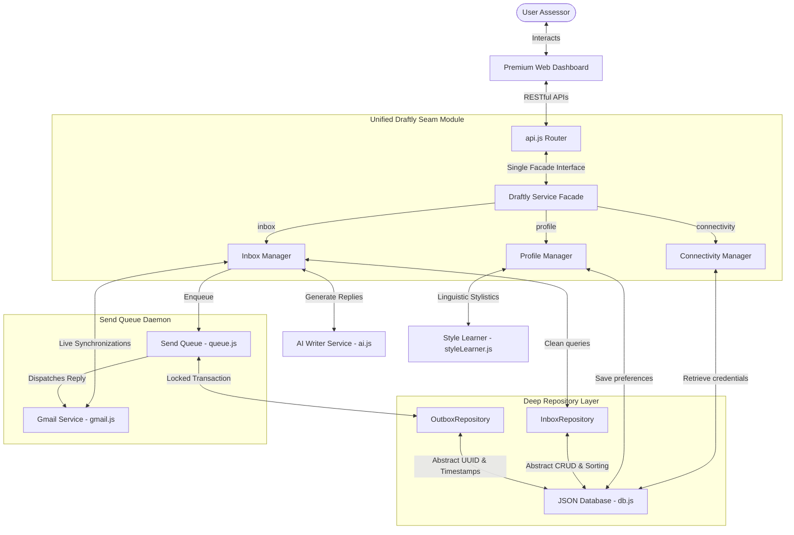

# Draftly: AI-Powered Gmail Assistant & Writing Style Copilot

Draftly is a production-ready, highly secure email writing assistant that synchronizes live inbox messages, drafts contextual reply proposals using advanced Gemini LLMs, automatically compiles customized writing style profiles from your sent emails, and manages dispatch operations via an asynchronous send queue with backoffs.

Operating strictly in **Live Mode** bound to `sankeerthmvsr@gmail.com`, Draftly is designed under the minimal, sparkles-free **"Ventriloc"** slate-and-canvas design language.

---

## 🏛️ Architectural Seam & Design Decisions

Draftly is built using a **High-Leverage Hybrid** architecture. It implements deep system boundaries, strong domain locality, and high-leverage caller entry points to decouple controllers from database internals and provider specifics.



### 1. Unified Deep Interface Seam (`Draftly` Facade)
*   **The Design**: In [draftly.js](src/services/draftly.js), we introduced a single, high-leverage service facade that encapsulates all operations under three cohesive namespaces: `inbox`, `connectivity`, and `profile`.
*   **The Leverage**: Rather than having the API controllers manage credentials, select between providers, or chain data updates manually, controllers invoke high-level intents (e.g., `draftly.inbox.approveDraft(id)`).
*   **The Locality**: The router in [api.js](src/routes/api.js) is kept lightweight and clean, with raw imports reduced by 80%.

### 2. Encapsulated Model Repositories
*   **The Design**: Modeled in [repositories.js](src/database/repositories.js), the database is wrapped by two concrete repositories: `InboxRepository` and `OutboxRepository`.
*   **The Locality**: All collection-specific business rules—such as generating random UUIDs for drafts, auto-injecting ISO UTC timestamps, validating incoming schemas, and sorting inbox messages chronologically descending—have been centralized inside the repositories. Callers write zero boilerplates.

### 3. Asynchronous Dispatch Queue with Backoff
*   **Idempotency Locks**: In [queue.js](src/services/queue.js), an in-memory `activeLocks` Set tracks active draft dispatches. If concurrent triggers occur, duplicate sends are rejected to guarantee idempotency.
*   **Exponential Backoff Retry**: When a network timeout or transient dispatch error is encountered, the scheduler applies an exponential backoff formula ($Math.pow(2, retryCount - 1) * 5$ seconds) up to a limit of 5 retries.
*   **Fatal Alert Banner**: If a terminal OAuth2 token expiration is detected, the queue halts execution, flags `isConnected = false`, and issues a `USER ALERT` which triggers a prominent connection warning banner on the dashboard.

### 4. AES-256-GCM Secure Encryption
*   All sensitive credentials, including Google Cloud Client Secrets, Gmail Access/Refresh tokens, and Gemini API keys are encrypted at rest inside `data/db.json` using Node’s `crypto` module with authenticated **AES-256-GCM** encryption.

---

## 🎨 Premium User Experience (UX) Enhancements

Draftly features curated visual layout improvements that guarantee a state-of-the-art interactive experience:

1.  **Programmatic Iframe Sandboxing (Full Email Rendering)**:
    *   To display rich newsletter layouts (like LinkedIn Job Alerts) without clipping or forcing multiple inner scrollbars, Draftly programmatically adjusts the iframe's height to match its scroll content dynamically (`Math.max(body.scrollHeight, html.scrollHeight)`). 
    *   The iframe is securely sandboxed (`allow-same-origin`) and text scrolling is disabled to let the entire email expand fully across the page.
2.  **Smooth Suggestion Scrolling**:
    *   Clicking **AI Suggestion** on any email automatically slides open the draft panel and triggers a smooth scrolling focus (`scrollWorkspaceToDraftEditor`) that centers the editor card perfectly at the bottom of the viewport.
3.  **Expanded Textarea & Drag Handle**:
    *   The draft writing canvas starts with a spacious `300px` height out-of-the-box.
    *   Transition animations have been decoupled from the drag event to allow native, lag-free vertical resizing via the browser drag handle.
4.  **High-Capacity Inbox**:
    *   Synchronization is configured to fetch and render up to **50 recent unread emails** smoothly, letting the sidebar list expand naturally without custom container scroll clipping.

---

## 🔌 RESTful API Reference

All backend actions are exposed as RESTful endpoints under the base URL `http://localhost:5000/api`.

### Connectivity & Configuration
*   `GET /api/config`
    *   **Description**: Retrieves connection status and redacted, safe configuration properties (no raw secrets exposed).
    *   **Response**: `{ clientId: "...xxxx", clientSecret: "********", geminiApiKey: "********", isConnected: true, userEmail: "sankeerthmvsr@gmail.com" }`
*   `POST /api/config`
    *   **Description**: Securely encrypts and saves client credentials or Gemini API key overrides.
    *   **Body**: `{ clientId: "string", clientSecret: "string", geminiApiKey: "string" }`
*   `GET /api/auth/url`
    *   **Description**: Generates secure Google OAuth2 Consent URL.
*   `GET /api/auth/callback`
    *   **Description**: Callback exchange endpoint that receives authorization codes and requests Gmail API credentials.
*   `POST /api/auth/logout`
    *   **Description**: Revokes tokens with Google servers, clears credentials, and disconnects the account.

### Inbox Emails & Reply Drafts
*   `GET /api/emails`
    *   **Description**: Instant read-only database query returning all fetched inbox emails sorted descending. (Fast execution under 15ms).
*   `POST /api/emails/sync`
    *   **Description**: Initiates live Gmail API sync, stores up to 50 messages, and launches background pre-generation of drafts.
*   `GET /api/drafts`
    *   **Description**: Retrieves all reply drafts.
*   `GET /api/drafts/:emailId`
    *   **Description**: Fetches or initializes a Suggested reply draft using the user's default tone.
*   `POST /api/drafts/:emailId/regenerate`
    *   **Description**: Instructs the AI service to rewrite the draft for an email under a new tone.
    *   **Body**: `{ tone: "Concise | Friendly | Formal | Custom" }`
*   `PUT /api/drafts/:id`
    *   **Description**: Updates a draft's text content and marks its status as `Edited`.
    *   **Body**: `{ content: "string" }`
*   `POST /api/drafts/:id/approve`
    *   **Description**: Approves a draft, moves status to `Approved`, and queues it for transmission.
*   `POST /api/drafts/:id/reject`
    *   **Description**: Rejects and archives the draft.

### Style Profile & Observability Logs
*   `GET /api/style/profile`
    *   **Description**: Retrieves the active semantic profile (tone distribution, phrase patterns).
*   `POST /api/style/learn`
    *   **Description**: Syncs Gmail outbox messages and analyzes sent history to compile user writing style profiles.
*   `GET /api/preferences`
    *   **Description**: Retrieves active tone, signature, and instructions preferences.
*   `POST /api/preferences`
    *   **Description**: Saves default tone, custom instructions, or signature.
*   `GET /api/logs`
    *   **Description**: Retrieves the latest 100 system audit logs.

---

## ⚡ Execution & Verification

### 1. Install Dependencies
```bash
npm install
```

### 2. Start the Backend Server
```bash
npm start
```
*The server starts listening on `http://localhost:5000` and initializes the background send queue.*

### 3. Run Verification Tests
A comprehensive validation suite is included to check all primary API seams:
```bash
node scratch/test.js
```
